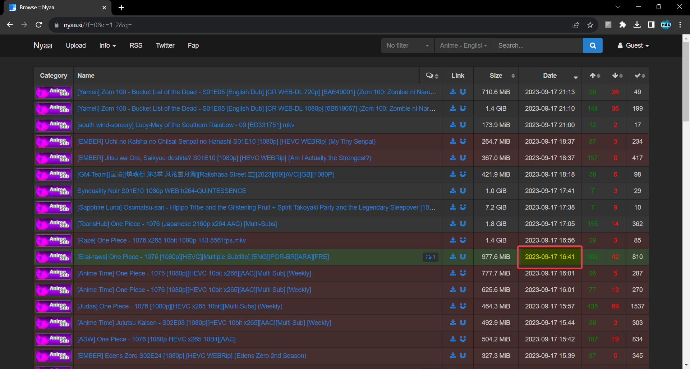
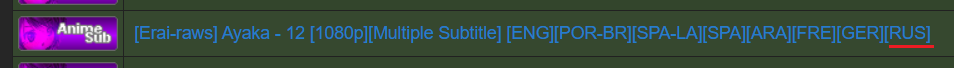

## Общая информация по релизам и срокам
Релизы делятся на онгоинги и неонгоинги.
Онгоинги – сериалы, которые выходят в данный момент времени.
Неонгоинги – сериалы, сезоны которых уже вышли.

##### Сериалы выходят по сезонам:
- Зима (январь-март)
- Весна (апрель-июнь)
- Лето (июль-сентябрь)
- Осень (октябрь-декабрь)

Перед началом сезона на сайте проходит голосование среди анонсированных новинок на предстоящий сезон на ТОП 10 самых ожидаемых аниме-сериалов сезона. Сериалы, попавшие в ТОП 10 берутся на озвучку в обязательном порядке, сериалы, что не попали в ТОП 10 берутся по желанию.
Сроки работы над онгоингами:
- Топ 10 – 2 суток с момента выхода английских субтитров, либо 1 сутки, если состав релиза так решил при распределении.
- Не топ – 4 суток с момента выхода английских субтитров.
  
В сроки работы над релизами входит время на перевод (поиск перевода), озвучку, тайминг, фиксы, сборку и заливку, т.е. всё от перевода до загрузки на сайт. 
Серии, выпущенные позже этих сроков, считаются задержкой и считаются красными. 
Есть такое понятие как зелёный релиз. Это серия онгоинга, выпущенная в течение суток после выхода английских субтитров (24 часа + допустимо выйти за рамки на 2 часа). 

:::note
Время выхода английских субтитров считается по выходу равки с субтитрами на [nyaa.si](https://nyaa.si).
Время там указывается ваше локальное

:::

## Обязанности технарей
- ~Выбор равки для полновесной раздачи торрента (х264);~ (только для неонгоингов)
- Монтаж, выписка и вставка фиксов войсеров, сведение звука в серии;
- Сборка матрёшки с видео кодеком х264 согласно правилам сборки;
- Создание и заливка торрента с релизом на сайт, а также поддержание раздачи до выкачивания релиза сидерами;
- Заливка в онлайн плеер на сайте через админ панель;
- *Update* релиза на сайте после заливки торрент-раздачи с х264 и появления актуальной серии в онлайн плеере.

## Виды равок
- **HDTVRip** – запись трансляции ТВ.
- **WEBRip** – извлеченный видеопоток со стримингового сервиса.
- **WEB-DLRip** – цифровая копия, приобретаемая в цифровом сервисе.
- **BDRip** – копия видеопотока с Blu-Ray диска (со сжатием, lossy).
- **BDRemux** – копия видеопотока с Blu-Ray диска (без сжатия, много весит, lossless).

## Основные форматы кодирования видео
- **H264/AVC**
- **H265/HEVC**
- Так же видеопоток может быть глубиной цвета **8 и 10 бит**.

## Различие форматов по названию
1. **HDTVRip**

- Ohys-Raws – команда, выкладывающая равку.
- MX – название телеканала, с которого шла запись.
- 1280х720 – разрешение видео (720p).
- x264 – он же h264, он же AVC - видео кодек.
- AAC – аудиокодек.
 
2. **WEBRip** – чаще всего не указывается вид равки: 

3. Так же если не указаны кодеки видео и звука, то это будут h264 и AAC соответственно.
Если видео в формате HEVC, то в названии это будет указано. Глубина цвета 8 бит - не указывается, 10 бит – указывается (иногда нет):

4. **BDRip** указывается в названии:

Тут видеопоток HEVC 10 бит (HEVC 8 бит не делают), аудиопоток в формате EAC3.

5. Если в серии присутствуют русские субтитры это будет указано:

Для <u>онгоингов</u> используем равки <u>WEBRip 1080p h264 8bit AAC</u>.
Для неонгоингов приоритет BDRip 1080p h264 8 бит, в случае отсутствия таковой выбор оговаривается с сидерами.

Раздачи в формате HEVC делаются отдельной подкомандой.

:::tip[Инфо]
Часть информации по выбору равок для онгоингов неактуальна, т.к. равки теперь автоматически кидает бот Асуна
:::