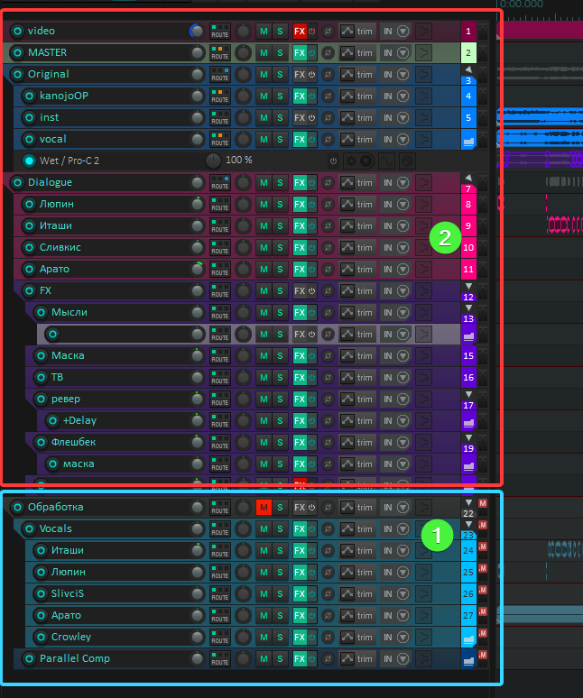
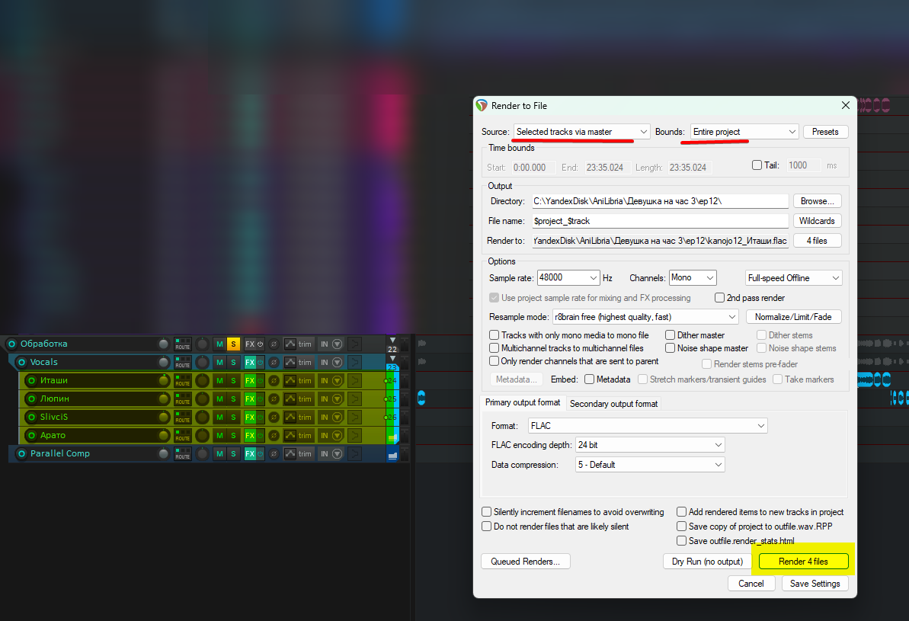

## 1 РАБОТА С ЭФФЕКТАМИ (im4x)

Для начала надо понимать что последовательность FX-плагинов очень важна на любом этапе сведения. В данном гайде я буду делить плагины на 2 категории, чтобы было проще понять. FX, Плагин, FX-плагин - тут это синонимы.

К первой категории относятся плагины обработки - эквалайзер, компрессор, диэссор и тд. те плагины которыми мы делаем наш вокальный трек законченным. Сюда же относятся плагины групповой обработки.

Ко второй категории относятся плагины эффектов, это могут быть те же самые эквалайзеры и компрессоры, но с другой задачей и другими настройками, ревербераторы, дилеи, фланжеры, стереорасширители и прочие. Те плагины которыми мы делаем эффекты.

Важно! Плагины эффектов должны быть строго после плагинов обработки. 

Ниже рассмотрим несколько способов этого добиться.

**

### 1 СПОСОБ - Использование [скрипта](https://drive.google.com/file/d/1ST0Vh9WjS0rswKnknvyedOVp5rptf62h/view?usp=sharing)

****

Скрипт нажатием одной клавиши применит обработку трека для выделенных айтемов (срендерит каждый айтем с обработкой которая есть на этом треке), перенесет обработанные айтемы на выбранный трек, и замутит оригинальные айтемы. Удобно тем, что не надо рендерить весть трек, и если вы изменили обработку вокала, или получили фикс на фразу в этом месте, просто удаляете айтем из FX-трека и заново запускаете скрипт для нужного айтема. “Минус” в том, что каждый айтем после скрипта это отдельный файлик в папке проекта, и таких файлов может быть сотни, хотя вес этих файлов вообще незначительный.

### 2 СПОСОБ - Freeze Track

****

В окне FX кликаем правой кнопкой мыши по пустому пространству и выбираем Freeze track > Freeze track to mono, up to last non-offline FX

Запустится процесс рендера этого трека, в итоге трек будет выглядеть так:

****

Чтобы можно было двигать фрагменты (айтемы) надо нажать на замок.

После этого вырезаем фрагменты на которых должен быть эффект, и переносим их на трек с эффектами.

****

Мы можем сделать Unfreeze trac, и вернуть все как было, но айтемы которые мы перенесли на треки с эффектами остануться, и их нужно удалять вручную.

****

Этот способ подходит для больших, нагруженных проектов, где все фиксы стоят на своих местах или их нет, и обработка финальная, т.е. точно не будет меняться в будущем. Только при таких условиях мы можем спокойно фризить все вокальные треки и раскидывать их по трекам с эффектами.

### **3 СПОСОБ - Обработка вокальных треков в том же проекте с последующим рендером по отдельности**
Суть проста: делим проект на 2 зоны. Первая отвечает за всю обработку (в т.ч. групповую).
Втоая зона - за эффекты и сведение с оригиналом.

Сводим вокал, выравниваем громкость, рендерим отдельными треками через мастер, затем добавляем эти треки во вторую "зону" и сводим уже с оригиналом.

Плюсы в меньшей нагрузке на процессор, удобство работы с эффектами и громкостью отдельных айтемов.
Минус в том что придется рендерить несколько дорог, затем еще весь микс. Фиксы придется рендерить тоже отдельно (если вставляете их в самом конце). Однако это всё компенсируется прессетами рендера.
:::tip
**Рекомендую пользоваться 1 или 3 способом**
:::

----

## **2 ТАЙМИНГ(im4x)**

Сейчас, говоря “тайминг” имеют ввиду “укладку” или “монтаж” реплик; проставление меток на оговорки, пропуски, и эффекты. Выписывание фиксов.

### 1 Субтитры

Чтобы субтитры отображались в Рипере их нужно экспортировать в .srt формат.

Для этого открываем субтитры в AegiSub > Файл > Экспорт субтитров > Экспорт > Указываем Имя файла и Тип файла SubRip (.srt) > Сохранить

Далее, в Рипере Extensions > Notes > Замочек > Import > Выбираем .srt файл > Открыть > Замочек

****

****

**Внимание! В Рипере есть особенность, он не отображает первую строку субтитров. Чтобы это исправить, перед импортом откройте .srt файл в AegiSub и добавьте строку с любым текстом в самом начале. Сохраните, затем импортируйте в Рипер.**

    ****

****

### **2 Укладка**

Чтобы ускорить тайминг, рекомендую сделать бинд для действия I**tem: Auto trim/split items (remove silence)...** Теперь одной кнопкой мы убираем пустоту и шум между фразами сразу для всех выделенных треков. Рекомендуемые настройки ниже.

****

Выделяем айтемы > нажимаем на кнопку на которую сделали бинд > настраиваем (настройки сохранятся) > нажимаем **Process**

****

**Внимание! Громкие щелчки, хлопки, и фразы в моменте где записан шум нужно удалять вручную, либо на этапе чистки.**

## 3 ПОЛЕЗНЫЕ СКРИПТЫ

### 1 Фаст покраска региона ([скачать](https://drive.google.com/file/d/1Fm5_oJpvCK1s3wQ58Ln_6pxwT-yME13J/view?usp=sharing))

****

### **2 Изменить громкость айтема под курсором**

**Установка**: 

1. Скачать **Reapack**

2. В поиске найти и установить “**Change volume for item under mouse cursor**”

3. Заходим в **Actions - Show action list**

4. Находим наш скрипт 

5. Заходим в **Edit action** и меняем этот параметр на “**1 db**”

6. Биндим на удобные вам клавиши

### 3 Таймер в видео плеере ([скачать](https://pastebin.com/rpZ599Dx))

Добавляем на дорожку с видео плагин Video Processor (встроенный в Рипер) и вставляем в него [следующий код](https://pastebin.com/rpZ599Dx)

****
