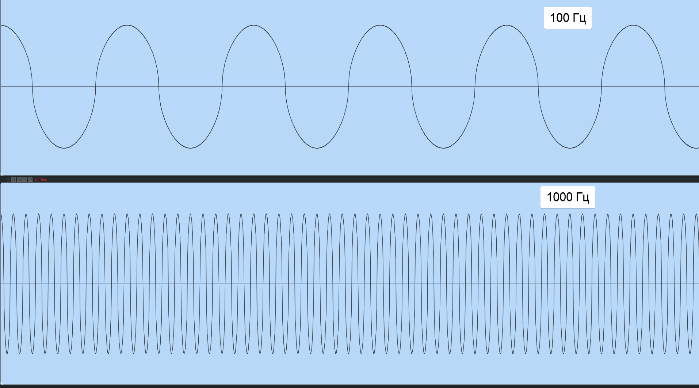

## Что Есть Звук?
Звук - это интерпретация нашим мозгом определенного типа событий. Этим событием является изменение давления воздуха. 
Это изменение или вариация давления воздуха вызвано вибрацией поверхности. 

Звук - это любое изменение давления воздуха, которое могут уловить наши уши. В качестве примера можно привести кожу барабана, которая вибрирует при ударе, двигается вверх-вниз и толкает воздух рядом с собой. Эти колебания вызывают волны звукового давления. Затем волны звукового давления
передаются в наши уши, и мы слышим звук.

:::tip
Звук возникает, когда что-то вибрирует
:::

Волна звукового давления - это цикл сжатия и разжатия воздуха. Волна звукового давления (сокращенно звуковая волна) может быть представлена на графике в виде волновой формы. График формы волны показывает, как изменяется давление воздуха с течением времени после возникновения вибрации.

****

На приведенном выше графике показаны изменения давления воздуха для звуковой волны. Такой график вы увидите в любой компьютерной системе записи/редактирования звука, например Pro Tools. Восходящая часть звуковой волны называется сжатием, а нисходящая - разрежением (она же "декомпрессия").

## Амплитуда
Амплитуда - это мера интенсивности звука. На графике формы волны (рис. 1) амплитуда обозначается тем, насколько выше или ниже центральной линии проходит график. Амплитуда звуковой волны измеряется в дБ (децибелах) и похожа (но не тождественна) громкости или громкости. Чем сильнее вибрирует поверхность, тем выше амплитуда создаваемого ею звука.

:::tip
Амплитуда не всегда равна громкости
:::

Даже если амплитуда звуковой волны меняется от положительного значения до нуля и отрицательного значения, наши уши/мозг воспринимают ее громкость как среднее значение за определенное время.

## Частота 

Частота звуковой волны связана с ее тоном. Частота определяется как количество циклов в секунду. Цикл равен одной части сжатия и одной части разрежения звуковой волны
волны (например, 1 бит "вверх" + 1 бит "вниз"). Звуковая волна с более высоким тоном будет вызывать больше циклов сжатия и разрежения воздуха в секунду, чем звук с более низким тоном.

Частота измеряется в герцах (Гц). Гц - это количество циклов в секунду звуковой волны. Например, звуковая волна с частотой 400 Гц будет сжиматься и разжиматься 400 раз в секунду. Звуковая волна частотой 100 Гц пройдет только 100 циклов в секунду и будет иметь более низкую частоту, чем звук частотой 400 Гц.

